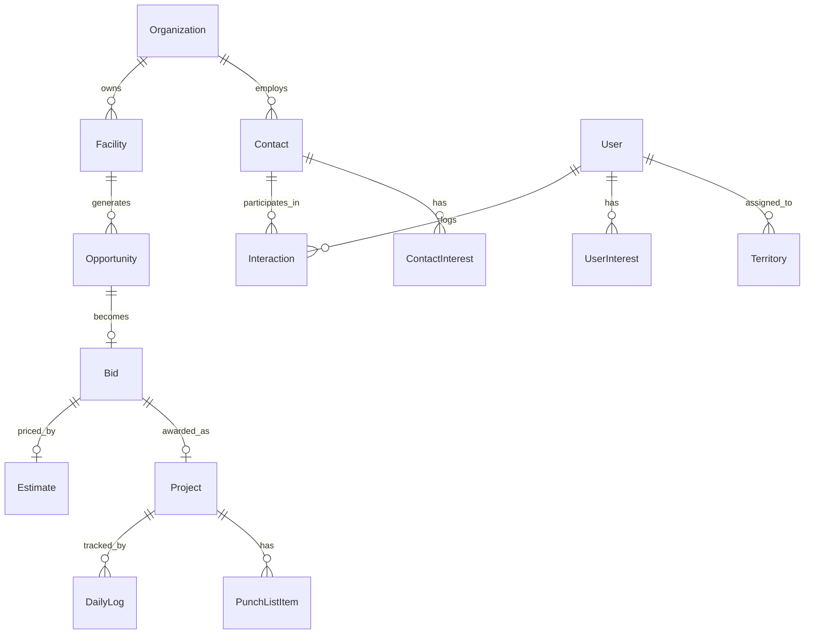
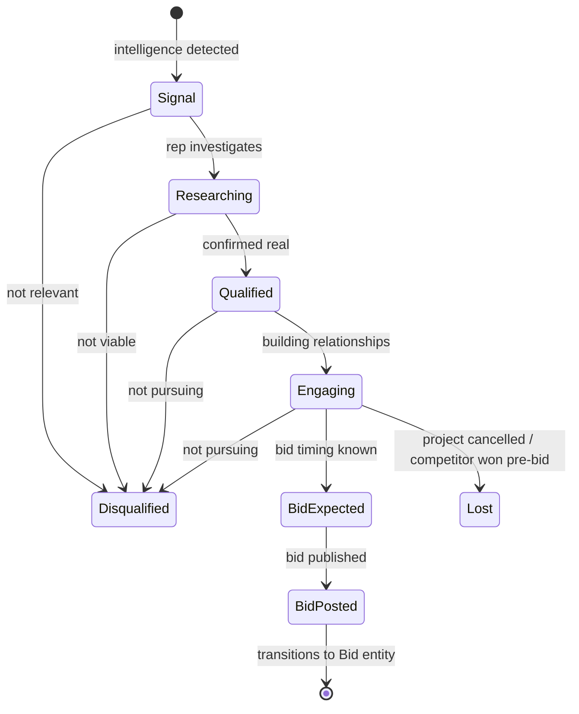
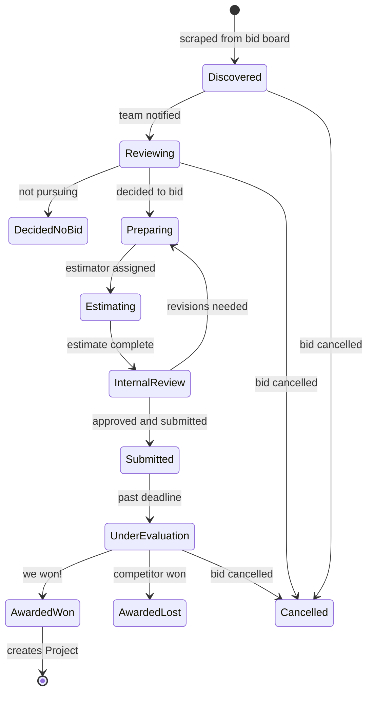
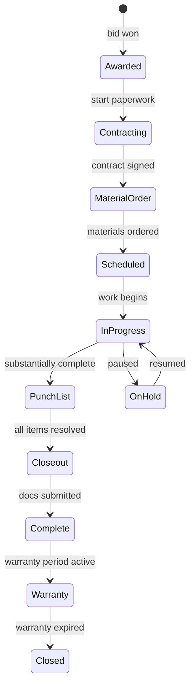
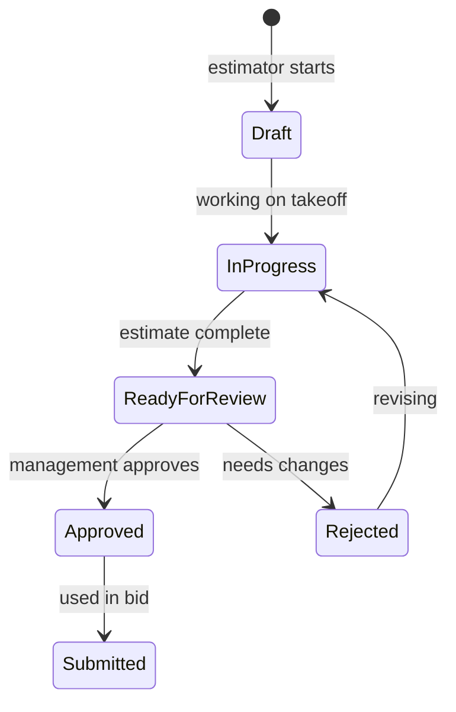

# Domain Model

## Vision & Purpose

The domain model defines every entity in Salescraft, their attributes, relationships, and lifecycle states. This is the single source of truth — every other spec references these definitions. The model reflects how a commercial flooring company actually operates: organizations have facilities, facilities need flooring, projects go through a lifecycle from intelligence signal through warranty.

## Key Concepts

- **Organization** — A school district, city, county, or other entity that buys flooring
- **Facility** — A physical building owned by an organization (school, city hall, library)
- **Contact** — A person associated with an organization who influences or decides on flooring purchases
- **Opportunity** — A potential flooring project identified through intelligence signals
- **Bid** — A formal solicitation (IFB/RFP/RFQ) that the company may respond to
- **Estimate** — A detailed cost calculation for a potential project
- **Project** — An awarded contract being executed (installation)
- **Interaction** — Any touchpoint with a contact (call, email, meeting, site visit)
- **Interest** — A personal hobby, passion, or activity associated with a contact or user

## Entity Relationship Overview



## Core Entities

### User

The internal team members who use Salescraft.

```typescript
interface User {
  id: string;                    // UUID
  email: string;                 // Unique, used for login
  passwordHash: string;          // bcrypt hashed
  firstName: string;             // Required, 1-100 chars
  lastName: string;              // Required, 1-100 chars
  role: UserRole;                // Enum (see below)
  phone?: string;                // Mobile number for field notifications
  avatarUrl?: string;            // Profile photo
  territories: string[];         // Territory IDs assigned
  isActive: boolean;             // Soft-disable without deleting
  lastLoginAt?: DateTime;
  createdAt: DateTime;
  updatedAt: DateTime;
}

enum UserRole {
  OWNER = 'owner',                // Full access, approvals, financials
  SALES_MANAGER = 'sales_manager', // Team oversight, pipeline, approvals
  SALES_REP = 'sales_rep',        // Contacts, relationships, bids
  ESTIMATOR = 'estimator',        // Estimates, proposals, product specs
  PROJECT_MANAGER = 'project_manager', // Post-award project execution
  INSTALLER = 'installer',        // Mobile field app only
  ADMIN = 'admin',                // Office admin, compliance docs, reporting
}
```

### UserInterest

Personal interests/hobbies of internal team members (for reverse matching).

```typescript
interface UserInterest {
  id: string;
  userId: string;                 // FK → User
  category: InterestCategory;     // Enum: sports, outdoors, food, music, etc.
  name: string;                   // "bass fishing", "Lakers", "guitar"
  specifics?: string;             // "fly fishing on the Kern River"
  isPublic: boolean;              // Whether to use in matching (default true)
  createdAt: DateTime;
}
```

### Organization

School districts, cities, counties, and other entities that purchase flooring.

```typescript
interface Organization {
  id: string;
  name: string;                   // "Riverside Unified School District"
  type: OrganizationType;         // Enum (see below)
  subType?: string;               // "Elementary", "High School" for schools
  website?: string;
  phone?: string;
  address: Address;               // Embedded object
  territory?: string;             // Territory ID for assignment
  fiscalYearStart: number;        // Month (1-12), e.g., 7 for July
  annualBudget?: number;          // Known or estimated facilities budget
  purchasingThreshold: number;    // Dollar amount above which formal bidding required
  cooperativeContracts: string[]; // ["Sourcewell", "OMNIA"] — active cooperative memberships
  approvedVendor: boolean;        // Whether we're on their approved vendor list
  approvedVendorExpiry?: Date;    // When AVL status expires
  notes?: string;
  tags: string[];                 // Flexible categorization
  createdAt: DateTime;
  updatedAt: DateTime;
  createdBy: string;              // FK → User
}

enum OrganizationType {
  SCHOOL_DISTRICT = 'school_district',
  CHARTER_SCHOOL = 'charter_school',
  COMMUNITY_COLLEGE = 'community_college',
  UNIVERSITY = 'university',
  CITY = 'city',
  COUNTY = 'county',
  STATE_AGENCY = 'state_agency',
  FEDERAL = 'federal',
  SPECIAL_DISTRICT = 'special_district', // Water district, fire district, etc.
}

interface Address {
  street1: string;
  street2?: string;
  city: string;
  state: string;                  // 2-letter code
  zip: string;                    // 5 or 9 digit
  latitude?: number;              // For mapping
  longitude?: number;
}
```

### Facility

Physical buildings that may need flooring.

```typescript
interface Facility {
  id: string;
  organizationId: string;         // FK → Organization
  name: string;                   // "Lincoln Elementary", "City Hall Annex"
  type: FacilityType;             // Enum (see below)
  address: Address;
  yearBuilt?: number;             // Critical for estimating flooring age
  totalSqFt?: number;             // Total building square footage
  flooringSqFt?: number;          // Estimated flooring area
  lastFlooringProject?: Date;     // When flooring was last replaced
  lastFlooringType?: string;      // What was installed last time
  conditionRating?: number;       // 1-5 scale, from facility condition assessments
  notes?: string;
  createdAt: DateTime;
  updatedAt: DateTime;
}

enum FacilityType {
  ELEMENTARY_SCHOOL = 'elementary_school',
  MIDDLE_SCHOOL = 'middle_school',
  HIGH_SCHOOL = 'high_school',
  ADMIN_BUILDING = 'admin_building',
  LIBRARY = 'library',
  COMMUNITY_CENTER = 'community_center',
  CITY_HALL = 'city_hall',
  FIRE_STATION = 'fire_station',
  POLICE_STATION = 'police_station',
  RECREATION_CENTER = 'recreation_center',
  COURTHOUSE = 'courthouse',
  PUBLIC_WORKS = 'public_works',
  OTHER = 'other',
}
```

### Contact

People at organizations who influence or decide on flooring purchases.

```typescript
interface Contact {
  id: string;
  organizationId?: string;        // FK → Organization (nullable: they might be between jobs)
  firstName: string;              // Required
  lastName: string;               // Required
  title?: string;                 // "Director of Facilities", "Purchasing Agent"
  role: ContactRole;              // Their function in purchasing decisions
  email?: string;
  phone?: string;
  mobile?: string;
  linkedinUrl?: string;
  address?: Address;
  decisionAuthority: DecisionAuthority; // Their influence level
  assignedTo?: string;            // FK → User (sales rep who owns this relationship)
  relationshipScore: number;      // 0-100 computed score
  lastContactedAt?: DateTime;     // Last interaction of any type
  lastContactedBy?: string;       // FK → User
  daysSinceContact: number;       // Computed, for decay alerts
  notes?: string;
  tags: string[];
  source: string;                 // How we found them: "trade_show", "referral", "linkedin", "bid_response"
  isActive: boolean;              // Still in role (false = left org or retired)
  previousOrganizations: PreviousOrg[]; // Track career moves
  createdAt: DateTime;
  updatedAt: DateTime;
  createdBy: string;              // FK → User
}

enum ContactRole {
  FACILITY_DIRECTOR = 'facility_director',
  MAINTENANCE_SUPERVISOR = 'maintenance_supervisor',
  PURCHASING_AGENT = 'purchasing_agent',
  CFO = 'cfo',
  SUPERINTENDENT = 'superintendent',
  BOARD_MEMBER = 'board_member',
  CITY_MANAGER = 'city_manager',
  PUBLIC_WORKS_DIRECTOR = 'public_works_director',
  ARCHITECT = 'architect',
  GENERAL_CONTRACTOR = 'general_contractor',
  PRINCIPAL = 'principal',
  OTHER = 'other',
}

enum DecisionAuthority {
  DECISION_MAKER = 'decision_maker',     // Signs the PO / awards the contract
  INFLUENCER = 'influencer',             // Influences specs or vendor selection
  BUDGET_HOLDER = 'budget_holder',       // Controls the money
  GATEKEEPER = 'gatekeeper',             // Controls access to decision makers
  END_USER = 'end_user',                 // Uses the facility, may provide input
  CHAMPION = 'champion',                 // Actively advocates for your company
}

interface PreviousOrg {
  organizationId: string;
  organizationName: string;
  title: string;
  startDate?: Date;
  endDate?: Date;
}
```

### ContactInterest

Personal interests, hobbies, and attributes of contacts (for relationship building).

```typescript
interface ContactInterest {
  id: string;
  contactId: string;              // FK → Contact
  category: InterestCategory;     // Enum (see below)
  name: string;                   // "fly fishing", "Golden State Warriors", "BBQ"
  specifics?: string;             // "Lakes in the Sierra", "Season ticket holder"
  confidence: number;             // 0-1, how confident we are (1 = they told us, 0.5 = inferred)
  source: InterestSource;         // How we learned this
  sourceDetail?: string;          // "Mentioned in call on 2024-03-15"
  lastConfirmedAt?: DateTime;     // When this was last validated
  createdAt: DateTime;
  updatedAt: DateTime;
}

enum InterestCategory {
  SPORTS_TEAM = 'sports_team',        // Professional/college teams they follow
  SPORTS_ACTIVITY = 'sports_activity', // Sports they play (golf, tennis, etc.)
  OUTDOORS = 'outdoors',              // Fishing, hunting, hiking, camping
  FOOD_DRINK = 'food_drink',          // BBQ, wine, craft beer, cooking
  MUSIC = 'music',                    // Genres, instruments, concerts
  TRAVEL = 'travel',                  // Destinations, travel style
  FAMILY = 'family',                  // Kids, grandkids, spouse interests
  EDUCATION = 'education',            // Alma mater, degrees, certifications
  COMMUNITY = 'community',            // Volunteering, church, clubs
  HOBBIES = 'hobbies',               // Woodworking, gardening, cars, etc.
  PETS = 'pets',                      // Dogs, cats, horses
  ENTERTAINMENT = 'entertainment',    // Movies, TV, books, gaming
}

enum InterestSource {
  DIRECT_CONVERSATION = 'direct_conversation', // They told us
  SOCIAL_MEDIA = 'social_media',               // Found on LinkedIn/Facebook
  AI_INFERRED = 'ai_inferred',                 // Extracted from email/call content
  NEWS_MENTION = 'news_mention',               // Local news, community events
  MANUAL_ENTRY = 'manual_entry',               // Rep entered it
  REFERRAL = 'referral',                       // Someone else told us
}
```

### ContactLifeEvent

Significant events in a contact's life (for timely outreach).

```typescript
interface ContactLifeEvent {
  id: string;
  contactId: string;              // FK → Contact
  type: LifeEventType;
  description: string;            // "Promoted to Director of Facilities"
  date: Date;                     // When it happened/will happen
  source: string;                 // How we know: "linkedin", "conversation", "news"
  acknowledged: boolean;          // Whether a rep has acted on this (sent congrats, etc.)
  acknowledgedBy?: string;        // FK → User
  acknowledgedAt?: DateTime;
  createdAt: DateTime;
}

enum LifeEventType {
  BIRTHDAY = 'birthday',
  WORK_ANNIVERSARY = 'work_anniversary',
  PROMOTION = 'promotion',
  NEW_ROLE = 'new_role',           // Moved to a new organization
  RETIREMENT = 'retirement',
  AWARD = 'award',                 // Professional recognition
  CHILD_MILESTONE = 'child_milestone', // Graduation, sports achievement
  PERSONAL_ACHIEVEMENT = 'personal_achievement',
  ELECTED = 'elected',             // Won a school board or council seat
  TERM_ENDED = 'term_ended',       // Board/council term ended
}
```

### Interaction

Every touchpoint with a contact, across all channels.

```typescript
interface Interaction {
  id: string;
  contactId: string;              // FK → Contact
  userId: string;                 // FK → User (who had the interaction)
  type: InteractionType;
  direction: 'inbound' | 'outbound';
  subject?: string;               // Email subject, call purpose
  summary?: string;               // Brief description or AI-generated summary
  details?: string;               // Full notes, email body excerpt
  personalNotes?: string;         // Personal details learned ("boat is named 'Gone Fishin'")
  duration?: number;              // Minutes (for calls, meetings)
  sentiment?: 'positive' | 'neutral' | 'negative'; // AI-assessed
  nextSteps?: string;             // What was promised/committed
  nextStepDueDate?: Date;
  relatedBidId?: string;          // FK → Bid (if interaction is about a specific bid)
  relatedProjectId?: string;      // FK → Project
  attachments: Attachment[];
  createdAt: DateTime;            // When the interaction happened
}

enum InteractionType {
  EMAIL = 'email',
  PHONE_CALL = 'phone_call',
  VIDEO_CALL = 'video_call',
  IN_PERSON_MEETING = 'in_person_meeting',
  SITE_VISIT = 'site_visit',
  PRE_BID_MEETING = 'pre_bid_meeting',
  TRADE_SHOW = 'trade_show',
  SCHOOL_BOARD_MEETING = 'school_board_meeting',
  CITY_COUNCIL_MEETING = 'city_council_meeting',
  LUNCH_DINNER = 'lunch_dinner',
  TEXT_SMS = 'text_sms',
  LINKEDIN_MESSAGE = 'linkedin_message',
  NOTE = 'note',                  // Internal note (not a direct interaction)
}
```

### Gesture

Gifts, meals, and relationship-building gestures sent to contacts.

```typescript
interface Gesture {
  id: string;
  contactId: string;              // FK → Contact
  userId: string;                 // FK → User (who sent/did it)
  type: GestureType;
  description: string;            // "Sent a fishing lure", "Lunch at The Grill"
  value?: number;                 // Dollar value (for ethics tracking)
  date: Date;
  occasion?: string;              // "Birthday", "Promotion", "Holiday", "Just because"
  reaction?: string;              // How they responded
  ethicsCleared: boolean;         // Confirmed within jurisdiction gift limits
  jurisdictionLimit?: number;     // The applicable gift limit
  createdAt: DateTime;
}

enum GestureType {
  GIFT = 'gift',
  MEAL = 'meal',
  EVENT_TICKETS = 'event_tickets',
  HANDWRITTEN_NOTE = 'handwritten_note',
  ARTICLE_SHARED = 'article_shared',
  REFERRAL_GIVEN = 'referral_given',
  CONGRATULATIONS = 'congratulations',
  DONATION = 'donation',           // To their charity/cause
}
```

### Opportunity

A potential flooring project identified through intelligence signals.

```typescript
interface Opportunity {
  id: string;
  facilityId?: string;            // FK → Facility (if known)
  organizationId: string;         // FK → Organization
  title: string;                  // "Lincoln Elementary - Flooring Replacement"
  status: OpportunityStatus;      // State machine (see below)
  source: OpportunitySource;      // How discovered
  sourceDetail?: string;          // "CIP 2024-2029 page 47"
  estimatedValue?: number;        // Rough dollar estimate
  estimatedSqFt?: number;        // Approximate square footage
  estimatedTimeline?: string;     // "Summer 2025", "FY 2025-26"
  flooringTypes?: string[];       // Expected product types needed
  score: number;                  // 0-100 AI-computed opportunity score
  scoreFactors: ScoreFactor[];    // Why this score
  assignedTo?: string;            // FK → User
  notes?: string;
  discoveredAt: DateTime;
  bidExpectedBy?: Date;           // When we expect a formal bid to drop
  relatedBidId?: string;          // FK → Bid (once a bid is published)
  createdAt: DateTime;
  updatedAt: DateTime;
}

enum OpportunityStatus {
  SIGNAL = 'signal',              // Raw intelligence signal detected
  RESEARCHING = 'researching',    // Actively gathering more info
  QUALIFIED = 'qualified',        // Confirmed real opportunity, worth pursuing
  ENGAGING = 'engaging',          // Actively building relationships / positioning
  BID_EXPECTED = 'bid_expected',  // Know a bid is coming, waiting for it
  BID_POSTED = 'bid_posted',      // Formal bid has been published (linked to Bid entity)
  DISQUALIFIED = 'disqualified',  // Not pursuing (too far, too small, wrong product, etc.)
  LOST = 'lost',                  // Someone else got it / project cancelled
}

enum OpportunitySource {
  BOND_MEASURE = 'bond_measure',
  CAPITAL_IMPROVEMENT_PLAN = 'capital_improvement_plan',
  MEETING_AGENDA = 'meeting_agenda',
  BUILDING_AGE = 'building_age',
  BID_BOARD = 'bid_board',
  RELATIONSHIP = 'relationship',   // Learned from a contact
  ARCHITECT_PROJECT = 'architect_project',
  NEWS_ARTICLE = 'news_article',
  MANUAL = 'manual',              // Sales rep identified it
}

interface ScoreFactor {
  factor: string;                 // "building_age", "bond_funded", "relationship_strength"
  weight: number;                 // 0-1
  value: number;                  // 0-100
  explanation: string;            // "Building is 22 years old (typical replacement at 15-20)"
}
```

### Bid

A formal solicitation from a government entity.

```typescript
interface Bid {
  id: string;
  opportunityId?: string;         // FK → Opportunity (if we knew about it beforehand)
  organizationId: string;         // FK → Organization
  facilityIds: string[];          // FK → Facility[] (can cover multiple buildings)
  title: string;                  // Official bid title
  bidNumber?: string;             // Government-assigned bid number
  type: BidType;
  status: BidStatus;              // State machine (see below)
  source: string;                 // Where posted: "BidNet", "PlanetBids", "district_website"
  sourceUrl?: string;             // Direct link to posting
  description?: string;           // Scope summary
  estimatedValue?: number;        // Our estimate of project value
  publishedAt: Date;              // When the bid was posted
  preBidMeetingAt?: Date;         // Pre-bid conference date
  preBidMeetingLocation?: string;
  preBidMeetingMandatory: boolean;
  questionsDeadline?: Date;       // Last day to submit questions
  submissionDeadline: Date;       // Bid due date/time
  awardDate?: Date;               // Expected or actual award date
  bondRequired: boolean;
  bondPercentage?: number;        // e.g., 10 for bid bond, 100 for performance
  prevailingWage: boolean;        // Whether prevailing wage applies
  wageCounty?: string;            // County for wage determination lookup
  insuranceRequirements?: string;
  documents: BidDocument[];       // RFP, addenda, plans, specs
  addenda: Addendum[];
  decision: BidDecision;          // Our bid/no-bid decision
  decisionReason?: string;        // Why we're bidding or not
  decisionBy?: string;            // FK → User who made the call
  assignedTo?: string;            // FK → User (sales rep)
  estimatorId?: string;           // FK → User (estimator assigned)
  estimateId?: string;            // FK → Estimate (our pricing)
  submittedAt?: DateTime;         // When we submitted our response
  submittedAmount?: number;       // Our bid price
  result?: BidResult;
  resultReason?: string;          // Why we won/lost
  winningAmount?: number;         // What the winner bid (if we lost)
  winningCompany?: string;        // Who won (if not us)
  projectId?: string;             // FK → Project (if we won)
  createdAt: DateTime;
  updatedAt: DateTime;
}

enum BidType {
  IFB = 'ifb',                    // Invitation for Bid (lowest responsive bidder wins)
  RFP = 'rfp',                    // Request for Proposal (best value evaluation)
  RFQ = 'rfq',                    // Request for Quote (informal)
  COOPERATIVE = 'cooperative',     // Through cooperative purchasing program
  SOLE_SOURCE = 'sole_source',     // Direct award
}

enum BidStatus {
  DISCOVERED = 'discovered',       // Found on bid board, not yet reviewed
  REVIEWING = 'reviewing',         // Team is evaluating bid/no-bid
  DECIDED_NO_BID = 'decided_no_bid', // Will not pursue
  PREPARING = 'preparing',         // Actively preparing our response
  ESTIMATING = 'estimating',       // Estimator is pricing
  INTERNAL_REVIEW = 'internal_review', // Management reviewing before submission
  SUBMITTED = 'submitted',         // Response submitted
  UNDER_EVALUATION = 'under_evaluation', // Waiting for award decision
  AWARDED_WON = 'awarded_won',     // We won!
  AWARDED_LOST = 'awarded_lost',   // Someone else won
  CANCELLED = 'cancelled',         // Bid cancelled by issuing agency
  PROTESTED = 'protested',         // Award is under protest
}

enum BidDecision {
  PENDING = 'pending',
  BID = 'bid',
  NO_BID = 'no_bid',
}

enum BidResult {
  WON = 'won',
  LOST = 'lost',
  CANCELLED = 'cancelled',
  NO_AWARD = 'no_award',          // No bids met requirements
}

interface BidDocument {
  id: string;
  name: string;
  type: 'rfp' | 'plans' | 'specs' | 'addendum' | 'response' | 'other';
  fileUrl: string;                // S3 URL
  uploadedAt: DateTime;
}

interface Addendum {
  number: number;
  title: string;
  issuedAt: Date;
  acknowledged: boolean;          // Whether we've acknowledged receipt
  documentUrl?: string;
}
```

### Estimate

Detailed cost calculation for a potential project.

```typescript
interface Estimate {
  id: string;
  bidId?: string;                 // FK → Bid (if for a formal bid)
  opportunityId?: string;         // FK → Opportunity (if pre-bid estimate)
  title: string;
  status: EstimateStatus;
  estimatorId: string;            // FK → User (who prepared it)
  reviewedBy?: string;            // FK → User (who approved it)
  version: number;                // Revision number
  areas: EstimateArea[];          // Breakdown by area/room
  materialTotal: number;          // Sum of all materials
  laborTotal: number;             // Sum of all labor
  equipmentTotal: number;         // Equipment rental, etc.
  subcontractorTotal: number;     // Subcontracted work (moisture testing, demo, etc.)
  subtotal: number;               // Sum of above
  overhead: number;               // Company overhead (% of subtotal)
  overheadPercentage: number;     // The overhead percentage used
  profit: number;                 // Profit margin
  profitPercentage: number;       // The margin percentage used
  bondCost?: number;              // Cost of bid/performance bonds
  total: number;                  // Final bid amount
  notes?: string;
  createdAt: DateTime;
  updatedAt: DateTime;
}

enum EstimateStatus {
  DRAFT = 'draft',
  IN_PROGRESS = 'in_progress',
  READY_FOR_REVIEW = 'ready_for_review',
  APPROVED = 'approved',
  REJECTED = 'rejected',          // Needs revision
  SUBMITTED = 'submitted',        // Used in a bid submission
}

interface EstimateArea {
  id: string;
  name: string;                   // "Room 101", "Hallway A", "Cafeteria"
  sqFt: number;                   // Measured square footage
  productId: string;              // FK → Product
  productName: string;            // Denormalized for easy display
  wasteFactor: number;            // Percentage (e.g., 10 for 10%)
  materialSqFt: number;           // sqFt * (1 + wasteFactor/100)
  materialCostPerSqFt: number;    // Unit cost
  materialTotal: number;          // materialSqFt * materialCostPerSqFt
  laborRatePerSqFt: number;       // Prevailing wage adjusted
  laborTotal: number;             // sqFt * laborRatePerSqFt
  additionalMaterials: LineItem[]; // Adhesive, transitions, etc.
  notes?: string;
}

interface LineItem {
  description: string;
  quantity: number;
  unit: string;                   // "sqft", "lf", "each", "gallon"
  unitCost: number;
  total: number;
}
```

### Product

Flooring products available for specification.

```typescript
interface Product {
  id: string;
  manufacturer: string;           // "Shaw", "Mohawk", "Tarkett", "Armstrong"
  productLine: string;            // "Sustain", "EcoWorx", etc.
  name: string;                   // Full product name
  type: FlooringType;
  subType?: string;               // "Plank", "Tile", "Broadloom"
  sku?: string;
  specifications: ProductSpecs;
  pricing: ProductPricing;
  warrantyYears?: number;
  adaCompliant: boolean;
  fireRating?: string;            // "Class 1", "Class 2"
  sustainabilityCerts: string[];  // ["FloorScore", "GreenGuard Gold"]
  installationMethod: string;     // "Glue-down", "Click-lock", "Stretch-in"
  typicalWasteFactor: number;     // Default waste % for this product
  typicalLaborRate: number;       // Base labor rate (before prevailing wage)
  isActive: boolean;
  updatedAt: DateTime;
}

enum FlooringType {
  LVT = 'lvt',                    // Luxury Vinyl Tile
  LVP = 'lvp',                    // Luxury Vinyl Plank
  VCT = 'vct',                    // Vinyl Composition Tile
  SHEET_VINYL = 'sheet_vinyl',
  CARPET_TILE = 'carpet_tile',
  BROADLOOM_CARPET = 'broadloom_carpet',
  RUBBER = 'rubber',
  LINOLEUM = 'linoleum',
  EPOXY = 'epoxy',
  POLISHED_CONCRETE = 'polished_concrete',
  HARDWOOD = 'hardwood',
  LAMINATE = 'laminate',
  CERAMIC_TILE = 'ceramic_tile',
  PORCELAIN_TILE = 'porcelain_tile',
}

interface ProductSpecs {
  wearLayerMils?: number;         // Wear layer thickness in mils (LVT/LVP)
  totalThicknessMm?: number;      // Total product thickness
  widthInches?: number;
  lengthInches?: number;
  weightPerSqFt?: number;
  moistureResistant: boolean;
  slipResistance?: string;        // DCOF rating
  soundRating?: string;           // IIC/STC ratings
  colorOptions: string[];
  patternOptions: string[];
}

interface ProductPricing {
  listPricePerSqFt: number;       // Manufacturer list price
  ourCostPerSqFt: number;         // Our negotiated cost
  lastUpdated: Date;
  priceBreaks?: PriceBreak[];     // Volume discounts
}

interface PriceBreak {
  minSqFt: number;
  pricePerSqFt: number;
}
```

### Project

An awarded contract being executed.

```typescript
interface Project {
  id: string;
  bidId?: string;                 // FK → Bid (if came from a bid)
  organizationId: string;         // FK → Organization
  facilityIds: string[];          // FK → Facility[]
  title: string;                  // Project name
  contractNumber?: string;        // Government contract number
  status: ProjectStatus;          // State machine (see below)
  projectManagerId: string;       // FK → User
  salesRepId: string;             // FK → User (who won it)
  contractAmount: number;         // Original contract value
  changeOrderTotal: number;       // Sum of approved change orders
  currentContractAmount: number;  // contractAmount + changeOrderTotal
  startDate?: Date;               // Actual or planned start
  completionDate?: Date;          // Actual or planned completion
  warrantyEndDate?: Date;         // When warranty expires
  ntpDate?: Date;                 // Notice to Proceed date
  scheduleConstraints?: string;   // "Summer only", "After 3pm", etc.
  prevailingWage: boolean;
  wageCounty?: string;
  crewIds: string[];              // FK → User[] (assigned installers)
  materialOrders: MaterialOrder[];
  changeOrders: ChangeOrder[];
  documents: ProjectDocument[];
  createdAt: DateTime;
  updatedAt: DateTime;
}

enum ProjectStatus {
  AWARDED = 'awarded',            // Contract awarded, pre-construction
  CONTRACTING = 'contracting',    // Executing contract docs, bonds, insurance
  MATERIAL_ORDER = 'material_order', // Ordering materials, waiting on delivery
  SCHEDULED = 'scheduled',        // Start date set, crews assigned
  IN_PROGRESS = 'in_progress',    // Active installation
  PUNCH_LIST = 'punch_list',      // Substantially complete, fixing deficiencies
  CLOSEOUT = 'closeout',          // Final documentation, warranty registration
  COMPLETE = 'complete',          // Project done and closed
  WARRANTY = 'warranty',          // In warranty period (monitoring)
  CLOSED = 'closed',              // Warranty expired, fully closed
  ON_HOLD = 'on_hold',           // Paused (weather, funding, etc.)
}

interface MaterialOrder {
  id: string;
  productId: string;
  quantity: number;               // Square feet ordered
  orderDate: Date;
  expectedDelivery: Date;
  actualDelivery?: Date;
  poNumber?: string;
  cost: number;
  status: 'ordered' | 'shipped' | 'delivered' | 'partial';
}

interface ChangeOrder {
  id: string;
  number: number;                 // Sequential within project
  description: string;
  amount: number;                 // Positive = increase, negative = deduction
  status: 'pending' | 'approved' | 'rejected';
  requestedAt: Date;
  approvedAt?: Date;
  approvedBy?: string;            // Contact at the organization who approved
}

interface ProjectDocument {
  id: string;
  type: 'contract' | 'bond' | 'insurance' | 'submittal' | 'closeout' | 'warranty' | 'daily_log' | 'photo' | 'other';
  name: string;
  fileUrl: string;
  uploadedAt: DateTime;
  uploadedBy: string;
}
```

### DailyLog

Field crew daily production records.

```typescript
interface DailyLog {
  id: string;
  projectId: string;              // FK → Project
  userId: string;                 // FK → User (installer who logged)
  date: Date;                     // Work date
  hoursWorked: number;            // Total hours on site
  sqFtInstalled: number;          // Production for the day
  productInstalled?: string;      // What product was being installed
  areasWorked: string[];          // Room/area names
  crewSize: number;               // How many people on crew today
  weather?: string;               // Relevant for outdoor staging
  issues?: string;                // Problems encountered
  materialsUsed?: string;         // Material quantities consumed
  photos: string[];               // S3 URLs
  notes?: string;
  syncedAt?: DateTime;            // When synced from mobile (offline support)
  createdAt: DateTime;
}
```

### PunchListItem

Deficiencies to correct before project acceptance.

```typescript
interface PunchListItem {
  id: string;
  projectId: string;              // FK → Project
  location: string;               // "Room 201, northwest corner"
  description: string;            // "Seam separation at doorway transition"
  priority: 'critical' | 'major' | 'minor' | 'cosmetic';
  status: PunchListStatus;
  assignedTo?: string;            // FK → User (installer)
  reportedBy: string;             // FK → User or contact name
  reportedAt: Date;
  dueDate?: Date;
  completedAt?: DateTime;
  photos: string[];               // Before photos
  completionPhotos: string[];     // After photos showing fix
  notes?: string;
  createdAt: DateTime;
  updatedAt: DateTime;
}

enum PunchListStatus {
  OPEN = 'open',
  IN_PROGRESS = 'in_progress',
  COMPLETED = 'completed',
  VERIFIED = 'verified',          // PM confirmed the fix
  DISPUTED = 'disputed',         // Disagreement about whether it's a deficiency
}
```

### IntelligenceSignal

Raw data signals from monitoring sources.

```typescript
interface IntelligenceSignal {
  id: string;
  type: SignalType;
  source: string;                 // "planetbids.com", "boarddocs", "county_clerk"
  title: string;                  // What was found
  description?: string;           // Details
  url?: string;                   // Source URL
  rawData?: Record<string, unknown>; // Original scraped data
  organizationId?: string;        // FK → Organization (if matched)
  facilityId?: string;            // FK → Facility (if matched)
  opportunityId?: string;         // FK → Opportunity (if converted)
  processed: boolean;             // Whether AI has evaluated this
  dismissed: boolean;             // User dismissed as not relevant
  dismissedBy?: string;           // FK → User
  createdAt: DateTime;
}

enum SignalType {
  BID_POSTING = 'bid_posting',
  BOND_MEASURE = 'bond_measure',
  CIP_ENTRY = 'cip_entry',
  MEETING_AGENDA_ITEM = 'meeting_agenda_item',
  NEWS_ARTICLE = 'news_article',
  JOB_POSTING = 'job_posting',    // Facility manager job = new decision maker
  ARCHITECT_PROJECT = 'architect_project',
  BUILDING_PERMIT = 'building_permit',
  BUDGET_APPROVAL = 'budget_approval',
}
```

### Territory

Geographic sales territories. A territory is a named geographic region defined by a combination of counties, cities, and/or zip codes. Contacts are assigned to territories by their organization's primary address zip code (matched against territory zip codes) or city/county. Users can be assigned to multiple territories.

```typescript
interface Territory {
  id: string;
  name: string;                   // "West Region", "Inland Empire"
  description?: string;
  counties: string[];             // County names covered
  cities: string[];               // Specific cities (if not whole county)
  zipCodes: string[];             // 5-digit zip codes
  assignedTo: string[];           // FK → User[] (reps assigned)
  createdAt: DateTime;
  updatedAt: DateTime;
}
```

**Territory assignment rules:**
- An organization belongs to the territory whose zip codes/cities/counties match its primary address
- If an organization matches multiple territories, it appears in all of them
- A contact inherits territory from their organization
- Contacts without an organization are territory-less (visible to all)
- Must have at least one of: counties, cities, or zipCodes

## State Machines

### Opportunity Lifecycle


**Transition Guards:**
- Signal → Researching: requires `assignedTo` to be set
- Researching → Qualified: requires `estimatedValue` and `estimatedTimeline`
- Any → Disqualified: requires `notes` explaining why

### Bid Lifecycle


**Transition Guards:**
- Reviewing → Preparing: requires `decision = 'bid'` and `decisionBy`
- Reviewing → DecidedNoBid: requires `decision = 'no_bid'` and `decisionReason`
- Estimating → InternalReview: requires linked Estimate with status `ready_for_review`
- InternalReview → Submitted: requires Estimate status `approved`, `submittedAmount` set
- AwardedWon → Project creation: auto-creates Project entity with data from Bid

### Project Lifecycle


**Transition Guards:**
- Contracting → MaterialOrder: requires contract document uploaded, bonds and insurance confirmed
- Scheduled → InProgress: requires `startDate` set, `crewIds` assigned, materials delivered
- InProgress → PunchList: requires all DailyLogs show area coverage matching scope
- PunchList → Closeout: requires all PunchListItems in status `verified` or `disputed`
- Closeout → Complete: requires closeout documents uploaded (as-builts, warranty registration)

### Estimate Lifecycle


**Transition Guards:**
- InProgress → ReadyForReview: requires at least one EstimateArea, all totals calculated
- ReadyForReview → Approved: requires `reviewedBy` set (must be OWNER or SALES_MANAGER role)
- ReadyForReview → Rejected: requires rejection notes

## Indexes

### Critical Query Patterns and Required Indexes

```sql
-- Contact search (name, email, organization)
CREATE INDEX idx_contacts_search ON contacts USING gin(
  to_tsvector('english', first_name || ' ' || last_name || ' ' || coalesce(email, ''))
);
CREATE INDEX idx_contacts_org ON contacts(organization_id);
CREATE INDEX idx_contacts_assigned ON contacts(assigned_to);
CREATE INDEX idx_contacts_relationship_score ON contacts(relationship_score DESC);
CREATE INDEX idx_contacts_last_contacted ON contacts(last_contacted_at);

-- Interest matching (reverse search)
CREATE INDEX idx_contact_interests_category_name ON contact_interests(category, name);
CREATE INDEX idx_user_interests_category_name ON user_interests(category, name);

-- Bid deadlines and status
CREATE INDEX idx_bids_deadline ON bids(submission_deadline) WHERE status NOT IN ('awarded_won', 'awarded_lost', 'cancelled', 'decided_no_bid');
CREATE INDEX idx_bids_status ON bids(status);
CREATE INDEX idx_bids_org ON bids(organization_id);

-- Opportunity scoring
CREATE INDEX idx_opportunities_score ON opportunities(score DESC) WHERE status NOT IN ('disqualified', 'lost');
CREATE INDEX idx_opportunities_status ON opportunities(status);

-- Project status
CREATE INDEX idx_projects_status ON projects(status);
CREATE INDEX idx_projects_pm ON projects(project_manager_id);
CREATE INDEX idx_projects_completion ON projects(completion_date) WHERE status = 'in_progress';

-- Intelligence signals (unprocessed)
CREATE INDEX idx_signals_unprocessed ON intelligence_signals(created_at DESC) WHERE processed = false AND dismissed = false;

-- Interactions by contact (activity timeline)
CREATE INDEX idx_interactions_contact ON interactions(contact_id, created_at DESC);
CREATE INDEX idx_interactions_user ON interactions(user_id, created_at DESC);

-- Embeddings for semantic search
CREATE INDEX idx_embeddings_vector ON embeddings USING ivfflat (embedding vector_cosine_ops);
```

## Validation Rules Summary

| Entity | Field | Rules |
|--------|-------|-------|
| User | email | Required, valid email format, unique |
| User | password | Min 8 chars, 1 uppercase, 1 number |
| User | role | Must be valid UserRole enum value |
| Organization | name | Required, 1-200 chars |
| Organization | type | Must be valid OrganizationType enum |
| Organization | purchasingThreshold | Positive number, default 50000 |
| Contact | firstName, lastName | Required, 1-100 chars each |
| Contact | email | Valid email format if provided |
| Contact | relationshipScore | 0-100, computed (not user-settable) |
| ContactInterest | confidence | 0-1 decimal |
| ContactInterest | category | Must be valid InterestCategory enum |
| Bid | submissionDeadline | Required, must be future date (at creation) |
| Bid | bondPercentage | 0-100 if provided |
| Estimate | profitPercentage | 0-100, requires OWNER/SALES_MANAGER approval if < 10 |
| Estimate | areas | At least 1 area required for review |
| EstimateArea | sqFt | Positive number |
| EstimateArea | wasteFactor | 0-50 (percentage) |
| Project | contractAmount | Positive number |
| DailyLog | hoursWorked | 0-24 |
| DailyLog | sqFtInstalled | Non-negative |
| Gesture | value | Non-negative, must check against jurisdiction ethics limit |
| Territory | Must have at least one of: counties, cities, or zipCodes |

## Soft Delete and Audit

All entities use soft delete (`deletedAt: DateTime | null`) rather than hard delete. The system maintains an audit log for:
- All state transitions (with before/after states)
- All financial changes (estimate amounts, contract values)
- All user permission changes
- All data exports
- All bid submissions

```typescript
interface AuditEntry {
  id: string;
  entityType: string;             // "contact", "bid", "project"
  entityId: string;
  action: 'create' | 'update' | 'delete' | 'state_change' | 'access';
  actorId: string;                // FK → User
  changes?: Record<string, { from: unknown; to: unknown }>;
  metadata?: Record<string, unknown>;
  createdAt: DateTime;
}
```
